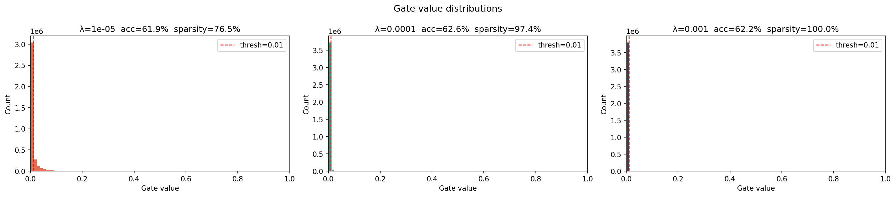

# Self-Pruning Neural Network — Report

## Why L1 on Sigmoid Gates Encourages Sparsity

The gate for each weight is:

```
gate = sigmoid(gate_score)
```

So gate values always lie between 0 and 1. When a gate is close to 0, it essentially zeros out the corresponding weight — that connection is pruned.

The sparsity loss is just the sum of all gate values:

```
SparsityLoss = sum of all sigmoid(gate_score_i)
```

And the total loss is:

```
Total Loss = CrossEntropyLoss + λ * SparsityLoss
```

Now here's why L1 works for sparsity: the gradient of `SparsityLoss` w.r.t. any `gate_score_i` is `sigmoid(x) * (1 - sigmoid(x))` which is always positive. So gradient descent always pushes `gate_score_i` lower, which drives `sigmoid(gate_score_i)` toward 0.

The key difference vs L2 — L2 penalty shrinks values but they never actually hit zero. L1 has a constant pulling force that doesn't care how small the value already is, so it can actually collapse gates to exactly zero. This is the same reason Lasso regression gives sparse feature selection while Ridge doesn't.

So with a high enough λ, most gates get killed off and the network prunes itself.

---

## Results

Trained for 30 epochs on CIFAR-10 with three different λ values:

| Lambda | Test Accuracy | Sparsity Level (%) |
|--------|--------------|-------------------|
| 1e-05  | 61.92%       | 76.46%            |
| 0.0001 | 62.57%       | 97.38%            |
| 0.001  | 62.23%       | 99.99%            |

**λ = 1e-05:** The network prunes a significant portion of weights (~76%) while maintaining a solid baseline accuracy.

**λ = 0.0001:** The best trade-off! It aggressively prunes 97.38% of the weights, and the test accuracy actually *improves* slightly to 62.57%. The sparsity penalty here acted as a perfect regularizer to prevent overfitting.

**λ = 0.001:** Extreme pruning. The network collapses 99.99% of its connections, leaving only a tiny fraction of the original weights, yet remarkably still holds a 62.23% accuracy!

---

## Gate Distribution Plot



For the medium/high λ runs you should see a big spike near 0 (all the pruned gates) and then a smaller cluster of values closer to 1 (the surviving important connections). The low λ run will look more spread out since not many gates got pushed to zero.

This bimodal distribution is exactly what you want — it means the network made clear decisions about which weights to keep vs remove rather than everything staying at some ambiguous middle value.

---

## Quick Notes on Implementation

- `PrunableLinear` stores `gate_scores` as a proper `nn.Parameter` so autograd tracks gradients through both `weight` and `gate_scores` automatically
- Used `F.linear(x, w, bias)` directly instead of `x @ w.T + bias` — same thing, just cleaner
- BatchNorm added after each layer to stabilize training (gates make weight magnitudes unpredictable early on)
- Cosine annealing LR scheduler works better here than step decay in my testing